# 🎵 **Sangeet PREMIUM V5** 🎵

<div align="center">

### *Where soul meets Music, not Noise...*

---


---

<!-- Animated Badges -->
<p align="center">
  
  
  
  
</p>

<!-- Live Status Badges -->
<p align="center">
  
  
  
  
</p>

<!-- Live Contributors -->
<p align="center">
  
  
  
</p>

</div>

---

## 📋 **Smart Navigation Menu**

<details open>
<summary><strong>🎯 Quick Access Menu - Click to Expand/Collapse</strong></summary>

<div align="center">

| 🎭 **Core Features** | 🛠️ **Technical** | 📚 **Resources** | 🤝 **Community** |
|:---:|:---:|:---:|:---:|
| [🎶 Music Player](#-music-player-excellence) | [🏗️ Architecture](#️-project-architecture) | [📖 Documentation](#-documentation--support) | [🤝 Contributing](#-contributing) |
| [📱 Offline Platform](#-offline-listening-platform) | [💻 Compatibility](#-system-compatibility) | [🚀 Installation](#-installation-guide) | [💬 Discussions](https://github.com/sangeet-premium/sangeet-premium-v5/discussions) |
| [🛠️ Developer Tools](#️-developer-friendly-architecture) | [🐳 Docker Setup](#-docker-installation) | [🎉 Getting Started](#-getting-started) | [🐛 Issues](https://github.com/sangeet-premium/sangeet-premium-v5/issues) |

</div>

**🔍 Search Shortcuts:**
- Press `Ctrl+F` and search for emojis (🎵, 🐳, 🚀) to quickly navigate
- Use section numbers for direct access
- All links are clickable for instant navigation

</details>

---

## 🎭 **What Is Sangeet Premium?**

<div align="center">

```ascii
   ╔═══════════════════════════════════════╗
   ║  🎵 MUSIC PLAYER + 📱 OFFLINE PLATFORM ║
   ║  +  🚀 SIMPLE APP = ✨ PERFECTION     ║
   ╚═══════════════════════════════════════╝
```

</div>

*Now you might be wondering what this extraordinary platform is. Is it a:*

- **🎵 Music Player** ✅
- **📱 Offline Listening Platform** ✅  
- **🚀 Simple App** ✅

**Here comes the beauty** - it's a perfect mixture of all mentioned above! Let's explore how:

---

## 🎶 **Music Player Excellence**

> **Sangeet Premium** is crafted as a sophisticated web application that transcends traditional streaming boundaries

<div align="center">

| Feature | Description | Status |
|---------|-------------|--------|
| 🎨 **Customizable UI** | Tailor interface to match your aesthetic | ✅ Active |
| 🔧 **Replaceable Elements** | Swap components seamlessly | ✅ Active |
| ♾️ **Infinite Possibilities** | Unleash creativity with personalization | ✅ Active |
| 🎯 **Personal Streaming** | Both streaming & media management | ✅ Active |

</div>

---

## 📱 **Offline Listening Platform**

*Transform your music experience with powerful offline capabilities:*

```mermaid
graph LR
    A[💾 Downloaded Content] --> B[⚡ Custom Storage]
    B --> C[🔄 Faster Access]
    C --> D[🎼 Your Collection]
    
    style A fill:#e1f5fe
    style B fill:#f3e5f5
    style C fill:#e8f5e8
    style D fill:#fff3e0
```

<div align="center">



</div>

### 🌟 **Offline Features:**

- **💾 Downloaded Content Management** - Organize your acquired music library efficiently
- **⚡ Custom Library Storage** - Store collections on disk for instant access
- **🔄 Reduced Load Times** - Faster playback through optimized local storage
- **🎼 Craftsman's Collection** - Access both online and offline musical masterpieces

---

## 🛠️ **Developer-Friendly Architecture**

*Built with simplicity and extensibility in mind:*

<div align="center">

<!-- Developer Benefits Chart -->
<table>
<tr>
<td align="center">

**📖 Clean Codebase**  
Easy to understand  
and modify

</td>
<td align="center">

**🔧 Framework Flexibility**  
Customize according  
to your needs

</td>
<td align="center">

**🐛 Debug-Friendly**  
Troubleshoot issues  
with ease

</td>
</tr>
<tr>
<td align="center">

**🔓 Open Source**  
Implement new  
features freely

</td>
<td align="center">

**🤝 Community-Driven**  
Truly welcoming  
contributions

</td>
<td align="center">

**⚡ Performance**  
Optimized for  
speed & efficiency

</td>
</tr>
</table>

</div>

---

## 🏗️ **Project Architecture**

*Sangeet Premium is built on a robust and scalable microservices architecture, orchestrated with Docker Compose.*

<div align="center">

### 🏛️ **System Overview**

```mermaid
graph TD
    subgraph "👤 User Layer"
        User[👨‍🎤 User] 
        UI[🌐 Web Interface]
        User --> UI
    end

    subgraph "🌐 Gateway & External Access"
        Cloudflare[☁️ Cloudflared Tunnel]
        Nginx[🚀 Nginx Reverse Proxy]
        User --> Cloudflare
        Cloudflare --> Nginx
    end

    subgraph "🎯 Core Application Services"
        UIServer[🖥️ Sangeet UI Server]
        StreamServer[🔊 Audio Stream Server]
        DownloadServer[⏬ File Download Server]
        LyricsServer[🎤 Lyrics API Server]
        
        Nginx --> UIServer
        Nginx --> StreamServer
        Nginx --> DownloadServer
        Nginx --> LyricsServer
    end

    subgraph "⚡ Background Processing"
        Redis[🐇 Redis Cache & Message Broker]
        CeleryWorker[🤖 Celery Worker]
        YTDLP[▶️ yt-dlp]
        LocalStorage[💽 Local Music Storage]
        
        UIServer --> Redis
        CeleryWorker --> Redis
        CeleryWorker --> YTDLP
        YTDLP --> LocalStorage
    end

    subgraph "💾 Data & Storage"
        PostgreSQL[🐘 PostgreSQL DB]
        DirectoryMonitor[📂 Directory Monitor]
        
        UIServer --> PostgreSQL
        StreamServer --> LocalStorage
        DownloadServer --> LocalStorage
        LyricsServer --> PostgreSQL
        CeleryWorker --> PostgreSQL
        DirectoryMonitor --> LocalStorage
        DirectoryMonitor --> PostgreSQL
    end

    %% Styling
    classDef userLayer fill:#e3f2fd,stroke:#1976d2,stroke-width:2px
    classDef gateway fill:#f3e5f5,stroke:#7b1fa2,stroke-width:2px
    classDef coreServices fill:#e8f5e8,stroke:#388e3c,stroke-width:2px
    classDef backgroundServices fill:#fff3e0,stroke:#f57c00,stroke-width:2px
    classDef dataServices fill:#fce4ec,stroke:#c2185b,stroke-width:2px
    
    class User,UI userLayer
    class Cloudflare,Nginx gateway
    class UIServer,StreamServer,DownloadServer,LyricsServer coreServices
    class Redis,CeleryWorker,YTDLP,LocalStorage backgroundServices
    class PostgreSQL,DirectoryMonitor dataServices
```

</div>



### 🔄 **Data Flow Examples**

```mermaid
sequenceDiagram
    participant U as 👤 User
    participant UI as 🌐 Web Interface
    participant N as 🚀 Nginx
    participant UIS as 🖥️ UI Server
    participant SS as 🔊 Stream Server
    participant DB as 🐘 PostgreSQL
    participant LS as 💽 Local Storage

    U->>UI: Search for "Song A"
    UI->>N: /search?q=Song A
    N->>UIS: Route to UI Server
    UIS->>DB: SELECT * FROM songs WHERE title LIKE '%Song A%'
    DB->>UIS: Return matching songs
    UIS->>UI: Display search results
    UI->>U: Show song list
    
    U->>UI: Click Play button
    UI->>N: /stream/song_id
    N->>SS: Route to Stream Server
    SS->>LS: Read audio file
    LS->>SS: Stream audio data
    SS->>U: Stream audio to browser
```

<details>
<summary><strong>🎵 Music Streaming Flow</strong></summary>



</details>

<details>
<summary><strong>⏬ Download Process Flow</strong></summary>



</details>

```mermaid
sequenceDiagram
    participant U as 👤 User
    participant UI as 🌐 Web Interface
    participant UIS as 🖥️ UI Server
    participant R as 🐇 Redis
    participant CW as 🤖 Celery Worker
    participant YT as ▶️ yt-dlp
    participant LS as 💽 Local Storage
    participant DB as 🐘 PostgreSQL

    U->>UI: Paste YouTube URL
    UI->>UIS: POST /download with URL
    UIS->>R: Create download task
    UIS->>UI: Task queued successfully
    
    Note over CW: Background Processing
    CW->>R: Pick up download task
    CW->>YT: Execute download
    YT->>LS: Save audio file
    CW->>DB: Insert song metadata
    CW->>R: Mark task complete
```

### 🧩 **Component Breakdown:**

<div align="center">

| Component | Purpose | Technology | Status |
|-----------|---------|------------|--------|
| 🚀 **Nginx Load Balancer** | Traffic routing & reverse proxy | Nginx | ✅ Active |
| 🖥️ **Sangeet UI Server** | Main application logic | Python/Bottle | ✅ Active |
| 🔊 **Stream Server** | Audio streaming service | Python/FastAPI | ✅ Active |
| 📥 **Download Server** | File download management | Python/Celery | ✅ Active |
| 🎤 **Lyrics Server** | Lyrics fetching & caching | Python/Flask | ✅ Active |
| 🤖 **Celery Worker** | Background task processing | Celery/Redis | ✅ Active |
| 🐘 **PostgreSQL** | Primary database | PostgreSQL 15 | ✅ Active |
| ⚡ **Redis Cache** | Caching & message broker | Redis 7 | ✅ Active |
| 🔄 **Directory Monitor** | Auto-discovery of local files | Python Script | ✅ Active |
| ☁️ **Cloudflared Tunnel** | Secure external access | Cloudflare | 🟡 Optional |

</div>

---

## 💻 **System Compatibility**

**Sangeet Premium** runs flawlessly on various architectures without modifications:

<div align="center">

### 🏗️ **Supported Architectures**

<table>
<tr>
<td align="center">

**ARM-based**  
🔧 x64, x32  
🎯 Raspberry Pi Compatible  
⚡ Energy Efficient

</td>
<td align="center">

**AMD64-based**  
🔧 x64, x86  
🎯 Desktop & Server  
⚡ High Performance

</td>
</tr>
</table>

### 🖥️ **Operating System Support**

| OS | Status | Performance | Docker Support | Recommendation |
|---|:---:|:---:|:---:|---|
| 🐧 **Linux** | ✅ Preferred | ⭐⭐⭐⭐⭐ | Native | **Best Choice** |
| 🪟 **Windows** | ✅ Compatible | ⭐⭐⭐⭐ | Docker Desktop | **Mainstream** |
| 🍎 **macOS** | ✅ Supported | ⭐⭐⭐⭐ | Docker Desktop | **Creative Pro** |

</div>

### **Why These Operating Systems?**

- **🐧 Linux**: Superior Docker integration, resource efficiency, developer-friendly
- **🪟 Windows**: Accessible with excellent Docker Desktop support
- **🍎 macOS**: Perfect for creatives with robust Unix architecture

---

## 🚀 **Installation Guide**

<div align="center">

### 🎯 **Quick Start - 4 Simple Steps**

</div>

Ready to experience this masterpiece? Let's get **Sangeet Premium** running on your system!

### **Prerequisites Checklist:**

- [ ] **Docker** installed ([Get Docker](https://docs.docker.com/get-docker/))
- [ ] **Docker Compose** available (included with Docker Desktop)
- [ ] **Git** installed ([Get Git](https://git-scm.com/downloads))
- [ ] **8GB RAM** minimum (16GB recommended)
- [ ] **10GB free disk space** minimum

---

## 🐳 **Docker Installation**

<div align="center">

**Sangeet Premium** leverages **Docker** - the ultimate containerization technology

<table>
<tr>
<td align="center">⚡ **Minimal Overhead**</td>
<td align="center">🔧 **Simplified Setup**</td>
<td align="center">🌐 **Cross-Platform**</td>
</tr>
<tr>
<td align="center">Efficient resource utilization</td>
<td align="center">No complex configuration</td>
<td align="center">Consistent experience everywhere</td>
</tr>
</table>

</div>

### **Step-by-Step Installation:**

#### **1️⃣ Clone the Repository**

```bash
# Clone the latest version
git clone "https://github.com/sangeet-premium/sangeet-premium-v5.git"

# Alternative: Download specific release
# wget https://github.com/sangeet-premium/sangeet-premium-v5/archive/refs/heads/main.zip
```

#### **2️⃣ Navigate to Project Directory**

```bash
cd sangeet-premium-v5

# Verify you're in the right directory
ls -la
# You should see: sangeet-services.yaml, docker-compose.yml, etc.
```

#### **3️⃣ Build Docker Images**

```bash
# Build all services (this may take 5-10 minutes)
sudo docker compose -f sangeet-services.yaml build

# Optional: Build with no cache (for clean build)
# sudo docker compose -f sangeet-services.yaml build --no-cache
```

#### **4️⃣ Start the Application**

<div align="center">

**Choose Your Preferred Method:**

</div>

<table>
<tr>
<td>

**🖥️ Foreground Mode**  
*(See logs in real-time)*
```bash
docker compose -f sangeet-services.yaml up
```

</td>
<td>

**🔄 Background Mode**  
*(Run as daemon)*
```bash
docker compose -f sangeet-services.yaml up -d
```

</td>
</tr>
</table>

### **🔧 Advanced Options:**

<details>
<summary><strong>🎛️ Configuration Options</strong></summary>

### route to /add-data to edit config make sure to change admin pass and add all other needed values 

#### default admin password is sangeet

### an automatic cloudflared tunnel will be generated if set the tunnel:false if you have your own cloudflared config then set as true and edit the config.yaml and music_server.json the got tunnel will be there in tunnel.txt all there in cloudflared folder

</details>

<details>
<summary><strong>🛠️ Troubleshooting Commands</strong></summary>

```bash
# Check service status
docker compose -f sangeet-services.yaml ps

# View logs
docker compose -f sangeet-services.yaml logs

# Restart specific service
docker compose -f sangeet-services.yaml restart sangeet_ui_server

# Clean rebuild
docker compose -f sangeet-services.yaml down
docker system prune -f
docker compose -f sangeet-services.yaml build --no-cache
```

</details>

---

## 🎉 **Getting Started**

<div align="center">

### 🎊 **Congratulations!** 🎊

**Sangeet Premium V5** is now running on your system!

*The musical universe is now at your fingertips - customize, enjoy, and create to your heart's content!*

</div>

### 🎯 **First Steps:**

<div align="center">

| Step | Action | URL | Description |
|:---:|--------|-----|-------------|
| **1** | **Access Application** | [`http://localhost:3401`](http://localhost:3401) | Main interface (local) for https :3400|

</div>

### 🎨 **Customization Guide:**


<summary><strong>📁 Music Library Setup</strong></summary>

1. **Add Local Folders**: Settings → Library → Add Folder
2. **Auto-Scan**: Enable automatic scanning for new files
3. **Metadata Management**: Configure tag reading preferences
4. **Import Playlists**: Support for M3U, PLS formats

</details>

<details>
<summary><strong>🔗 External Sources</strong></summary>

1. **YouTube Integration**: Paste URLs for direct download
2. **SoundCloud**: Connect your SoundCloud account
3. **Spotify Playlists**: Import playlist metadata
4. **Radio Streams**: Add internet radio stations

</details>

---

## 📖 **Documentation & Support**

<div align="center">

### 📚 **Comprehensive Resources**

</div>

| Resource | Description | Link | Status |
|----------|-------------|------|--------|
| 🐛 **Issue Tracker** | Bug reports & feature requests | [Issues](https://github.com/sangeet-premium/sangeet-premium-v5/issues) | ✅ Active |
| 💬 **Discussions** | Community Q&A | [Discussions](https://github.com/sangeet-premium/sangeet-premium-v5/discussions) | ✅ Active |

### 🆘 **Getting Help:**

```mermaid
flowchart TD
    A[Having Issues?] --> B{What type?}
    B -->|Bug Report| C[🐛 Create Issue]
    B -->|Feature Request| D[💡 Create Feature Request]
    B -->|Question| E[💬 Start Discussion]
    B -->|Security| F[📧 Email Directly]
    
    C --> G[📋 Use Bug Template]
    D --> H[📝 Use Feature Template]
    E --> I[🤝 Community Help]
    F --> J[🔒 Private Response]
    
    style A fill:#ffebee,stroke:#d32f2f
    style C fill:#e8f5e8,stroke:#388e3c
    style D fill:#e3f2fd,stroke:#1976d2
    style E fill:#fff3e0,stroke:#f57c00
    style F fill:#fce4ec,stroke:#c2185b
```

<div align="center">



</div>

---

## 🤝 **Contributing**

<div align="center">

### 🌟 **Join Our Growing Community!**

We welcome contributions from developers, designers, testers, and music enthusiasts!

</div>

### 🎯 **Ways to Contribute:**

<table>
<tr>
<td align="center">

**💻 Code**  
Features, fixes,  
optimizations

</td>
<td align="center">

**🎨 Design**  
UI/UX improvements,  
themes, icons

</td>
<td align="center">

**📝 Documentation**  
Guides, tutorials,  
translations

</td>
<td align="center">

**🧪 Testing**  
Bug reports,  
quality assurance

</td>
</tr>
</table>


### 🏆 **Contributor Recognition:**

<div align="center">

<!-- Contributors Graph -->


**🎉 Thank you to all our amazing contributors! 🎉**

</div>

---

## ⚖️ **Legal Disclaimer & License**

<div align="center">

### ⚠️ **IMPORTANT LEGAL INFORMATION** ⚠️

</div>

<details>
<summary><strong>🔽 Click to Expand Legal Disclaimers & License Information</strong></summary>

> **BY USING THIS SOFTWARE, YOU ACKNOWLEDGE AND AGREE TO THE FOLLOWING:**

### 🎯 **Educational & Research Purpose**

This project is developed **SOLELY** for:
- ✅ Educational purposes
- ✅ Research and development
- ✅ Demonstrating web technologies
- ❌ **NOT** for commercial use or piracy

### 🚫 **User Responsibility Matrix**

| Responsibility | User | Developers |
|----------------|:----:|:----------:|
| Legal Compliance | ✅ **YOU** | ❌ Not Us |
| Content Licensing | ✅ **YOU** | ❌ Not Us |
| Copyright Respect | ✅ **YOU** | ❌ Not Us |
| Local Law Adherence | ✅ **YOU** | ❌ Not Us |

### 📜 **License Information**

<div align="center">

**Dual License System:**

</div>

<table>
<tr>
<td align="center">

**🎓 Educational Use**  
Custom Educational License  
✅ Learning & Research  
❌ Commercial Use

</td>
<td align="center">

**🔓 Open Source Components**  
MIT License  
✅ Modify & Distribute  
✅ Private Use

</td>
</tr>
</table>

### 🛡️ **Liability Disclaimer**

```
THE SOFTWARE IS PROVIDED "AS IS", WITHOUT WARRANTY OF ANY KIND.
THE AUTHORS SHALL NOT BE LIABLE FOR ANY DAMAGES ARISING FROM USE.
```

### ✅ **Ethical Use Guidelines**

**Encouraged Use:**
- ✅ Learning programming concepts
- ✅ Understanding microservices architecture
- ✅ Contributing to open source
- ✅ Educational projects and research

**Discouraged Use:**
- ❌ Copyright infringement or piracy
- ❌ Commercial exploitation without permission
- ❌ Violating platform terms of service
- ❌ Any illegal activities

</details>

---

<div align="center">

## 🔗 **Quick Access Links**

<!-- Enhanced Badge Section -->
<p align="center">
  <a href="https://github.com/sangeet-premium/sangeet-premium-v5">
    
  </a>
  <a href="https://github.com/sangeet-premium/sangeet-premium-v5/issues">
    
  </a>
  <a href="https://github.com/sangeet-premium/sangeet-premium-v5/discussions">
    
  </a>
</p>

<p align="center">
  <a href="https://hub.docker.com/r/sangeetpremium/sangeet-premium-v5">
    
  </a>
  <a href="https://github.com/sangeet-premium/sangeet-premium-v5/blob/main/LICENSE">
    
  </a>
  <a href="https://github.com/sangeet-premium/sangeet-premium-v5/blob/main/CONTRIBUTING.md">
    
  </a>
</p>

### 📊 **Live Project Statistics**

<!-- Live Star History Chart -->


<!-- Live Activity Graph -->


### 🌟 **Community Stats**

<table>
<tr>
<td align="center">

<br><strong>GitHub Stars</strong>
</td>
<td align="center">

<br><strong>Forks</strong>
</td>
<td align="center">

<br><strong>Contributors</strong>
</td>
</table>

---
# _Made with love By Easy-Ware_
---
